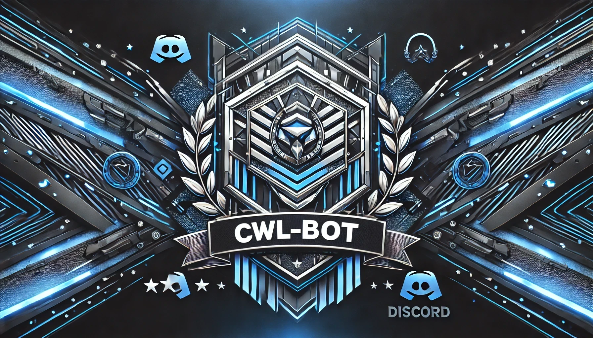

# CWL-Bot



CWL-Bot ist ein Discord-Bot, der speziell für die Verwaltung von **Clan Wars Lists (CWL)** entwickelt wurde. Mit CWL-Bot können Clan-Leader und Mitglieder effizient CWL-Einträge erstellen, anzeigen, löschen und verwalten. Der Bot nutzt moderne Technologien wie **Docker** und **PostgreSQL**, um eine zuverlässige und skalierbare Lösung zu bieten.

## Inhaltsverzeichnis

- [Features](#features)
- [Technologien](#technologien)
- [Voraussetzungen](#voraussetzungen)
- [Installation](#installation)
  - [1. Repository Klonen](#1-repository-klonen)
  - [2. Umgebungsvariablen Einrichten](#2-umgebungsvariablen-einrichten)
  - [3. Docker-Compose Konfigurieren](#3-docker-compose-konfigurieren)
  - [4. Initialisierungs-Skript Erstellen](#4-initialisierungs-skript-erstellen)
  - [5. Wait-for-it Skript Hinzufügen](#5-wait-for-it-skript-hinzufügen)
  - [6. Docker-Container Starten](#6-docker-container-starten)
- [Verwendung](#verwendung)
  - [Verfügbare Befehle](#verfügbare-befehle)
- [Fehlerbehebung](#fehlerbehebung)
- [Beitrag leisten](#beitrag-leisten)
- [Lizenz](#lizenz)
- [Kontakt](#kontakt)

## Features

- **CWL-Anmeldung:** Mitglieder können sich für Clan Wars anmelden und ihre Informationen direkt über Discord eingeben.
- **CWL-Liste Anzeigen:** Übersichtliche Darstellung aller CWL-Anmeldungen in Tabellenform.
- **CWL-Einträge Löschen:** Clan-Leader können einzelne oder alle CWL-Einträge verwalten.
- **Datenbankintegration:** Verwendet PostgreSQL zur Speicherung und Verwaltung von CWL-Daten.
- **Logging:** Implementiert detailliertes Logging zur Überwachung und Fehlerbehebung.
- **Dockerisiert:** Einfache Bereitstellung und Skalierung mittels Docker und Docker Compose.
- **Erweiterbar:** Strukturierte Codebasis zur einfachen Erweiterung und Anpassung.

## Technologien

- **Programmiersprache:** Python 3.11
- **Discord-Bibliothek:** discord.py
- **Containerisierung:** Docker, Docker Compose
- **Datenbank:** PostgreSQL 15.8
- **Weitere Tools:** asyncpg, tabulate

## Voraussetzungen

Bevor du mit der Installation beginnst, stelle sicher, dass folgende Software auf deinem System installiert ist:

- [Docker](https://www.docker.com/get-started)
- [Docker Compose](https://docs.docker.com/compose/install/)
- [Git](https://git-scm.com/downloads)

## Installation

### 1. Repository Klonen

Klone das Repository auf deinen lokalen Rechner:

```bash
git clone https://github.com/dein-benutzername/cwl-bot.git
cd cwl-bot
```

### 2. Umgebungsvariablen Einrichten

Erstelle eine `.env`-Datei im Stammverzeichnis des Projekts und füge die notwendigen Umgebungsvariablen hinzu:

```env
# .env

# Discord Bot Token
DISCORD_TOKEN=dein_discord_token

# PostgreSQL Datenbank Konfiguration
DB_NAME=deine_db_name
DB_USER=dein_db_user
DB_PASSWORD=dein_db_passwort
DB_HOST=db
DB_PORT=5432
```

**Hinweis:** Ersetze die Platzhalter (`dein_discord_token`, `deine_db_name`, etc.) mit deinen tatsächlichen Werten. Achte darauf, die `.env`-Datei sicher zu verwahren und nicht öffentlich zugänglich zu machen.

### 3. Docker-Compose Konfigurieren

Stelle sicher, dass deine `docker-compose.yml` korrekt eingerichtet ist. Hier ist ein Beispiel basierend auf deinem bisherigen Setup:

```yaml
version: '3.8'

services:
  db:
    image: postgres:15
    environment:
      POSTGRES_DB: ${DB_NAME}
      POSTGRES_USER: ${DB_USER}
      POSTGRES_PASSWORD: ${DB_PASSWORD}
    volumes:
      - db_data:/var/lib/postgresql/data
      - ./db/init.sql:/docker-entrypoint-initdb.d/init.sql:ro
    networks:
      - bot-network

  bot:
    build: .
    environment:
      - DISCORD_TOKEN=${DISCORD_TOKEN}
      - DB_HOST=${DB_HOST}
      - DB_PORT=${DB_PORT}
      - DB_NAME=${DB_NAME}
      - DB_USER=${DB_USER}
      - DB_PASSWORD=${DB_PASSWORD}
    depends_on:
      - db
    networks:
      - bot-network
    entrypoint: ["./scripts/wait-for-it.sh", "db:5432", "--", "python", "bot.py"]

volumes:
  db_data:

networks:
  bot-network:
```

### 4. Initialisierungs-Skript Erstellen

Erstelle eine `init.sql`-Datei im Verzeichnis `db/`, um die Datenbanktabellen und eventuell einige Anfangsdaten zu definieren.

**Beispiel `db/init.sql`:**

```sql
-- db/init.sql

-- Erstelle die Tabelle 'cwl'
CREATE TABLE IF NOT EXISTS cwl (
    id SERIAL PRIMARY KEY,
    username VARCHAR(50) UNIQUE NOT NULL,
    townhall INTEGER NOT NULL
);

-- Optional: Füge einige Anfangsdaten hinzu
INSERT INTO cwl (username, townhall) VALUES
('Benutzer1', 5),
('Benutzer2', 3)
ON CONFLICT (username) DO NOTHING;
```

### 5. Wait-for-it Skript Hinzufügen

Das `wait-for-it.sh` Skript stellt sicher, dass der Bot erst startet, nachdem die Datenbank bereit ist.

1. **Füge das Skript hinzu:**

   Erstelle ein Verzeichnis für Skripte und lade das `wait-for-it.sh` Skript herunter:

   ```bash
   mkdir scripts
   curl -o scripts/wait-for-it.sh https://raw.githubusercontent.com/vishnubob/wait-for-it/master/wait-for-it.sh
   chmod +x scripts/wait-for-it.sh
   ```

### 6. Docker-Container Starten

Starte die Docker-Container mit Docker Compose:

```bash
docker-compose up --build -d
```

**Erklärung:**

- `--build`: Baut die Docker-Images neu, falls Änderungen am Code vorgenommen wurden.
- `-d`: Startet die Container im Hintergrund (Detached Mode).

Überprüfe die Logs, um sicherzustellen, dass alles korrekt gestartet wurde:

```bash
docker-compose logs -f bot
docker-compose logs -f db
```

## Verwendung

Sobald der Bot erfolgreich gestartet ist und verbunden ist, kannst du die folgenden Befehle in deinem Discord-Server verwenden:

### Verfügbare Befehle

1. **/cwl_anmeldung**

   Startet den CWL-Anmeldeprozess. Mitglieder können ihre Anmeldedaten (Benutzername und Rathaus-Level) eingeben.

   **Beispiel:**
   ```
   /cwl_anmeldung
   ```

2. **/cwl_liste**

   Zeigt die aktuelle Liste der CWL-Anmeldungen in einer übersichtlichen Tabellenform an.

   **Beispiel:**
   ```
   /cwl_liste
   ```

3. **/cwl_loeschen <Benutzername>**

   Löscht den CWL-Eintrag eines bestimmten Benutzers. **Nur für Benutzer mit der Rolle 'CWL-Leiter' verfügbar.**

   **Beispiel:**
   ```
   /cwl_loeschen Benutzer1
   ```

4. **/cwl_loeschen_all**

   Löscht alle CWL-Anmeldungen. **Nur für Benutzer mit der Rolle 'CWL-Leiter' verfügbar.**

   **Beispiel:**
   ```
   /cwl_loeschen_all
   ```

5. **/help**

   Zeigt eine Hilfsnachricht mit allen verfügbaren Befehlen und deren Beschreibung an.

   **Beispiel:**
   ```
   /help
   ```

## Fehlerbehebung

### Datenbankverbindungsfehler

**Fehlermeldung:**
```
psycopg2.OperationalError: connection to server at "db" (172.19.0.3), port 5432 failed: Connection refused
Is the server running on that host and accepting TCP/IP connections?
```

**Lösungsansätze:**

1. **Überprüfe die Docker-Container:**
   - Stelle sicher, dass der Datenbank-Container läuft:
     ```bash
     docker-compose ps
     ```
   - Falls der Datenbank-Container nicht läuft, starte ihn neu:
     ```bash
     docker-compose up -d db
     ```

2. **Volume Initialisierung:**
   - Wenn du Änderungen an der `init.sql` vorgenommen hast, musst du möglicherweise das Datenbank-Volume neu erstellen:
     ```bash
     docker-compose down
     docker volume rm cwl-bot_db_data
     docker-compose up --build -d
     ```

3. **Netzwerk überprüfen:**
   - Stelle sicher, dass beide Dienste im selben Docker-Netzwerk sind (`bot-network`).

4. **Retry-Logik Implementieren:**
   - Stelle sicher, dass der Bot erst startet, wenn die Datenbank bereit ist. Dies wurde bereits in der `docker-compose.yml` durch das `wait-for-it.sh`-Skript umgesetzt.

5. **Datenbank-Konfiguration Überprüfen:**
   - Stelle sicher, dass die Umgebungsvariablen in der `.env`-Datei korrekt gesetzt sind und mit der `docker-compose.yml` übereinstimmen.

### Probleme mit CWL-Anmeldung

### Allgemeine Fehler

- **Logs Überprüfen:**
  Nutze die Docker-Logs, um detaillierte Fehlermeldungen zu erhalten:
  ```bash
  docker-compose logs -f bot
  docker-compose logs -f db
  ```

- **Abhängigkeiten Installieren:**
  Stelle sicher, dass alle Python-Abhängigkeiten installiert sind:
  ```bash
  pip install -r requirements.txt
  ```

## Beitrag leisten

Beiträge sind herzlich willkommen! Folge diesen Schritten, um zum Projekt beizutragen:

1. **Fork das Repository**
2. **Erstelle einen Feature-Branch**
   ```bash
   git checkout -b feature/dein-feature
   ```
3. **Commit deine Änderungen**
   ```bash
   git commit -m "Beschreibung deiner Änderungen"
   ```
4. **Push zum Branch**
   ```bash
   git push origin feature/dein-feature
   ```
5. **Erstelle einen Pull-Request**

## Lizenz

Dieses Projekt ist lizenziert unter der [MIT License](LICENSE).

---

*Viel Spaß mit dem CWL-Bot! 🚀*
